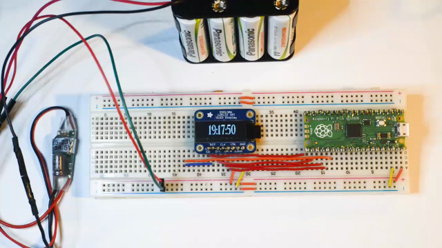

# Raspberry Pi Pico with SPI SSD1306 display
This text is in active development: March 30, 2022  
Content to come:
* font module
***

***

I had a new pico on my desktop along with an [Adafruit SSD1306 OLED display unit](https://www.adafruit.com/product/661), and the exercise was for the display unit to do pretty stuff.

***

## Inspiration:
The "hard" part of the code came from the guys in Delhi at [techatronic](https://techatronic.com/) (Hey, thanks guys!), with the base SPI and device driver code.

Their page [SSD1306 RASPBERRY PI PICO](https://techatronic.com/ssd1306-raspberry-pi-pico/) has the wiring and driver code (`ssd1306.py`), which I have included in the file list.

***

## Wiring

credit: https://techatronic.com/ssd1306-raspberry-pi-pico/

***

## My Demo Programs
### Program: `ssd1306main.py`
[video:](https://github.com/rongrimes/ssd1306/blob/main/pico%2Bssd1306%20main%20display.mp4)
(Sorry, you need to view in a separate window for now.)

Note: the rolling scan lines are a feature of the video process and do not appear on the SSD1306 device on the desktop.

This program cycles through the following:
* brief clock display
* simple counter
* simple 8 pixel text from framebuf
* simple box and cross lines
* line draw vertical
* line draw horizontal
* rectangle draw, going out

The clock display and simple counter use the font module.

***
### Program: `ssd1306clock.py`

[video:](https://github.com/rongrimes/ssd1306/blob/main/pico%2Bssd1306%20clock.mp4)
(Sorry, you need to view in a separate window for now.)

Note: the rolling scan lines are a feature of the video process and do not appear on the SSD1306 device on the desktop.

This video simply shows a 20 second period over a minute boundary.

### Clock Notes:

The clock in the videos shows real time. This is only because I started the clock code while the pico was tethered to a raspberry pi host which could initialize the pico RTC (real time clock). After program start, power was supplied by the battery pack and the raspberry pi was disconnected.

***

#### The font module
This was interesting. I don't know of any font to pixel translation or such and experimented with different ways. Eventually I found an old program: `printerbanner` on... well this is embarassing really. It was on the Windows Ubuntu platform. Now, I'm not running Ubuntu anywhere (besides the Windows WSL platform) and in particular it's not available on Raspberry PiOS.

`printerbanner` has the feature where you can specify the font size - in my case I wanted a font size of 28 pixels. (See **Design Limitation**: I will need to regenerate the font if I get a 64 line SSD1306 OLED Display).

The font file is mostly just `printerbanner` output redirected, along with a comments feature and a way to label each character. It's not clever, and I didn't even rotate the characters... but it works really well.

***

## Design Limitation
I have the SSD1306 128x32 SPI device. This means (obviously) that there are 32 horizontal lines. What is less obvious is that the lines are numbered 1,3,5,7... since this device is a reduced version of the 128x64 Display. The code takes this into account.

However the code is "not 64 line" ready, meaning... for a 64 line display, the code needs to be reviewed and adjusted accordingly. (I'll fix the code if/when I get a 64 line display - anyone want to send me a SSD1306 128x64 OLED device?)

***

## Power Pack
The video shows the pico and OLED being driven by a 9.6V NiMH power pack running a little [UBEC 5-23V > 5V 3A converter](https://www.aliexpress.com/item/590427933.html). It's a great little package for rechargeable power and low cost power components.
