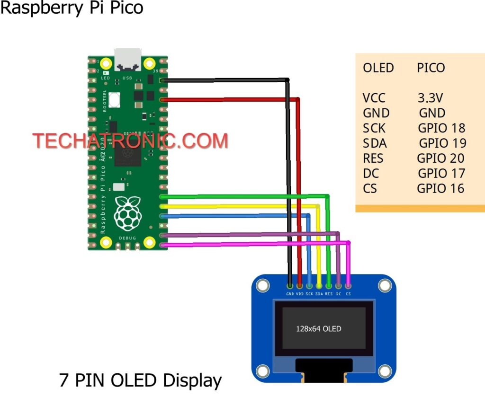

# Raspberry Pi Pico with SPI SSD1306 display
This text in active devlopment: March 30, 2022

I had a new pico on my desktop along with an Adafruit SSD1306 OLED display unit, and the exercise was to the diplay unit to do pretty stuff.

***

## Inspiration:
The "hard" part of the code came from the guys in Delhi at techatronic[techatronic](https://techatronic.com/) (Hey, thanks guys!), with the base SPI and device driver code.

Their page [SSD1306 RASPBERRY PI PICO](https://techatronic.com/ssd1306-raspberry-pi-pico/) has the wiring and driver code (`ssd1306.py`), which I have included in the file list.

***

## Wiring

credit: https://techatronic.com/ssd1306-raspberry-pi-pico/

***

## My Demo Programs
### Program: `ssd1306main.py`
[video:](https://github.com/rongrimes/ssd1306/blob/main/pico%2Bssd1306%20main%20display.mp4)
(Sorry, you need to view in a separate window for now.)

Note: the rolling scan lines are a feature of the video process and do not appear on the SSD1306 device on the desktop.

This program cycles through the following:
* brief clock display
* simple counter
* simple 8 pixel text from framebuf
* line draw vertical
* line draw horizontal
* rectangle draw, going out

The clock display and simple counter use the font module.

***
### Program: `ssd1306clock.py`

[video:](https://github.com/rongrimes/ssd1306/blob/main/pico%2Bssd1306%20clock.mp4)
(Sorry, you need to view in a separate window for now.)

Note: the rolling scan lines are a feature of the video process and do not appear on the SSD1306 device on the desktop.

This video simply shows a 20 second period over a minute boundary.

***

#### The font module
(Content coming)

***

## Design Limitation
The device I have is the SSD1306 128x32 SPI device. This means (obviously) that there are 32 horizontal lines. What is less obvious is that the line are number 1,3,5,7... The code takes this into account.

However the code is "not 64 line" ready, meaning... for a 64 line display, the code needs to be reviwed and adjusted accordingly. (I'll fix the code if/when I get a 64 line display - anyone want to send me a SSD1306 128x64 OLED device?)
